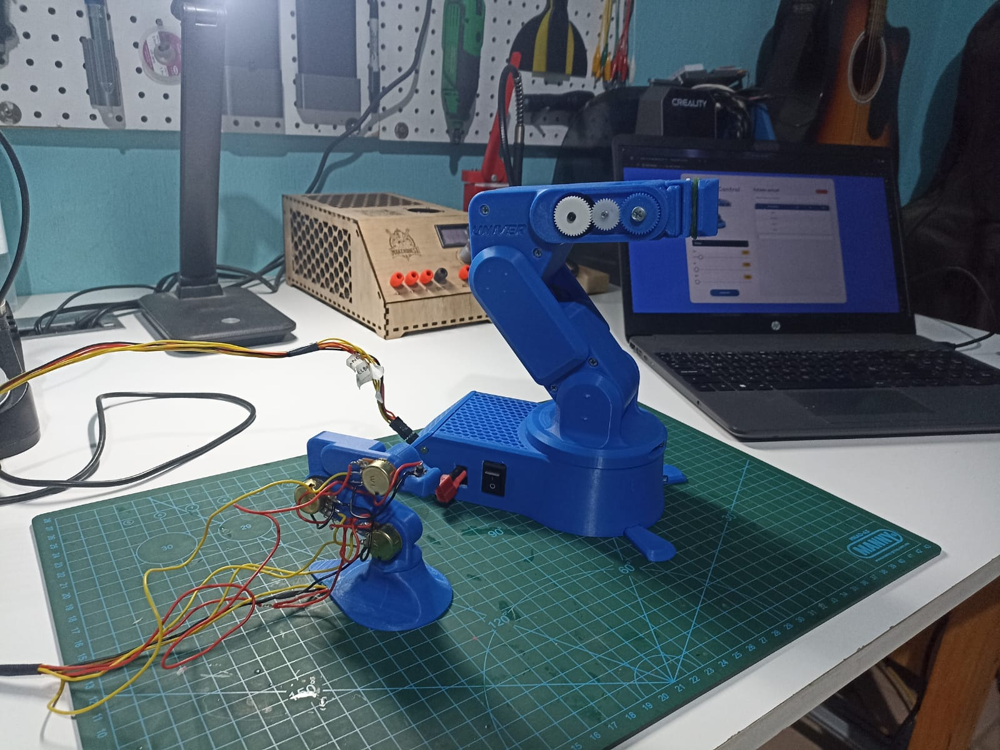
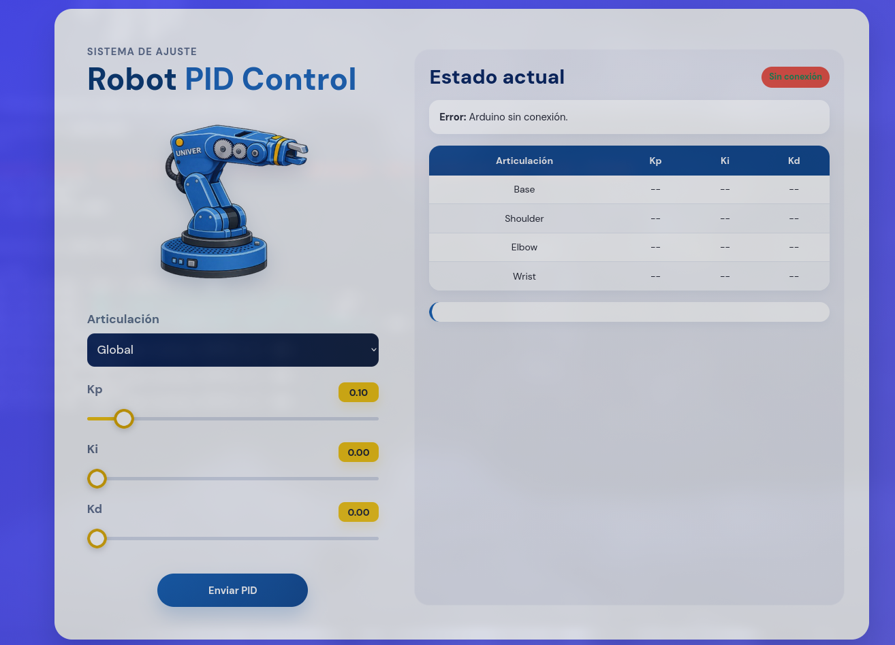

# Robot PID Control System

This project implements a master–slave robotic arm system with independent PID control on each joint, combined with a web interface for real-time parameter tuning.

---

## Overview

The system consists of:

- A master arm controlled by potentiometers (input reference)
- A slave robotic arm driven by servomotors
- A PID controller applied independently to each joint
- A web interface to adjust PID parameters in real time

The goal of the project is to demonstrate how PID control affects the dynamic behavior of a robotic system, including response speed, stability, and smoothness of motion.

---

## Objective

The objective of this project is to design and implement a master–slave robotic arm control system with independent PID controllers for each joint, allowing real-time adjustment of control parameters through a web interface.

The system is intended as an educational platform to demonstrate how PID control affects the dynamic behavior of a multi-degree-of-freedom robotic system, including response speed, stability, and smoothness of motion.

---

## Demo

### Physical System



### Control Interface



---


## Mechanical Platform

The physical robotic arm used in this project is based on the following model:

https://www.printables.com/model/818975-compact-robot-arm-arduino-3d-printed

The original design is licensed under Creative Commons Attribution–NonCommercial–NoDerivatives 4.0.

This model was used as a reference platform for testing and developing the control system. No modifications to the original design are distributed as part of this project.

The focus of this work is on the control and software implementation, including:

- Arduino firmware with PID control
- Web-based interface for real-time parameter tuning
- Serial communication and system integration

---

## System Operation

The control loop operates continuously as follows:

1. Read desired position from potentiometers
2. Compute error:

   error = targetPos - currentPos

3. Apply PID controller:

   PID = Kp * error + Ki * integral + Kd * derivative

4. Update servo position
5. Send PWM signal
6. Repeat

Each joint has its own independent PID controller.

---

## Technologies Used

### Hardware
- Arduino Uno
- Servomotors (MG996R, SG90, high-torque servos)
- Potentiometers (10kΩ)
- Servo control shield
- External power supply

### Software
- Arduino IDE
- Python 3
- Flask
- PySerial
- HTML / CSS / JavaScript

### Tools
- Git and GitHub
- Docker

---

## Web Interface

The web application allows:

- Selecting a joint (Base, Shoulder, Elbow, Wrist)
- Adjusting PID parameters (Kp, Ki, Kd)
- Sending parameters to Arduino via serial communication
- Receiving confirmation responses

This enables real-time tuning without reprogramming the microcontroller.

---

## Serial Port Configuration and Simulation Mode

The Flask backend communicates with the Arduino using serial communication via PySerial.

### Default Configuration (Linux)

By default, the system is configured for Linux-based systems:

```python
SERIAL_PORT = "/dev/ttyACM0"
BAUD_RATE = 115200
```

The application also attempts to automatically detect the Arduino by checking:

```python
possible_ports = ["/dev/ttyACM0", "/dev/ttyACM1"]
```

### Serial Ports by Operating System

| Operating System | Example Port |
|------------------|-------------|
| Linux            | `/dev/ttyACM0`, `/dev/ttyUSB0` |
| Windows          | `COM3`, `COM4`, `COM5` |
| macOS            | `/dev/cu.usbmodemXXXX`, `/dev/cu.usbserial-XXXX` |

If you are using Windows or macOS, you must manually update the `SERIAL_PORT` variable in `app/main.py`.

Example (Windows):

```python
SERIAL_PORT = "COM3"
```

Example (macOS):

```python
SERIAL_PORT = "/dev/cu.usbmodem14101"
```

---

### Simulation Mode

The project includes a simulation mode that allows the web application to run without a physical Arduino connected.

To enable simulation mode, modify the following line in `app/main.py`:

```python
SIMULATION_MODE = True
```

When simulation mode is enabled:

- No real serial connection is opened
- Commands are still generated normally
- A simulated Arduino response is returned
- The web interface can be fully tested without hardware

This is especially useful for:

- Frontend development
- Debugging communication logic
- Running the project on a different machine without the robot connected

## Serial Communication

Command format:

B,0.10,0.00,0.05

Where:
- B = Base (S, E, W for other joints)
- Values = Kp, Ki, Kd

Arduino response:

Recibido: B,0.10,0.00,0.05

---

## Project Structure

```bash
robot-pid-control/
├── app/
│   ├── main.py
│   ├── static/
│   │   ├── css/
│   │   ├── img/
│   │   └── js/
│   └── templates/
│       └── index.html
├── arduino/
│   └── arduino.ino
├── assets/
│   └── (images used in README)
├── extras/
│   └── serial_test.ino
├── Dockerfile
├── requirements.txt
├── README.md
└── .gitignore
```
---


## PID Implementation

Each joint is modeled using a structured approach containing:

- Current position (currentPos)
- Target position (targetPos)
- PID gains (kp, ki, kd)
- Integral accumulation
- Previous error

This allows:

- Independent control per joint
- Real-time parameter tuning
- Experimental analysis of system behavior

---
## Extras

### Serial Communication Test (Arduino + LCD)

This project includes an additional Arduino sketch located in the `extras/` directory:

```
extras/serial_test.ino
```

This sketch is used to test and validate serial communication between the Flask web application and the Arduino, without requiring the robotic arm hardware.

#### Purpose

- Verify that the web interface is correctly sending PID commands  
- Debug serial communication independently from the full system  
- Provide a simple visualization of received data using an LCD display  

#### Hardware Requirements

- Arduino Uno (or compatible board)  
- I2C LCD display (16x2)  
- I2C address: `0x27` (or `0x3F` depending on the module)  

#### How It Works

- The Arduino listens for incoming serial data at 115200 baud  
- When a message is received:
  - It is printed to the serial monitor (for debugging)  
  - It is displayed on the LCD screen  
- Messages longer than 16 characters are split across two lines  

#### Example

Input (from web interface):

```
B,0.10,0.00,0.05
```

Output (Serial Monitor):

```
Recibido: B,0.10,0.00,0.05
```

Output (LCD):

```
B,0.10,0.00,
0.05
```

#### Use Case

This tool is especially useful during development when:

- The robotic arm is not connected  
- You want to test communication logic only  
- You are debugging issues with parameter transmission  
---

## Running the Project

### Clone the repository

git clone https://github.com/xJosephMorganx/robot-pid-control.git  
cd robot-pid-control  

### Run with Python

pip install -r requirements.txt  
python app/main.py  

### Run with Docker

docker build -t robot-pid-control .  
docker run -p 5000:5000 robot-pid-control  

---

## Author

José Gómez 
Manufacturing and Robotics Engineering Student

## Contributors

 Angelica Aponte — Frontend design (UI/UX)

---

## License


This project is licensed under the GNU General Public License v3.0 (GPLv3).

This means that any derivative work must also be distributed under the same open-source license.

Note: The mechanical design of the robotic arm is not included in this repository and is subject to its own license (CC BY-NC-ND 4.0).